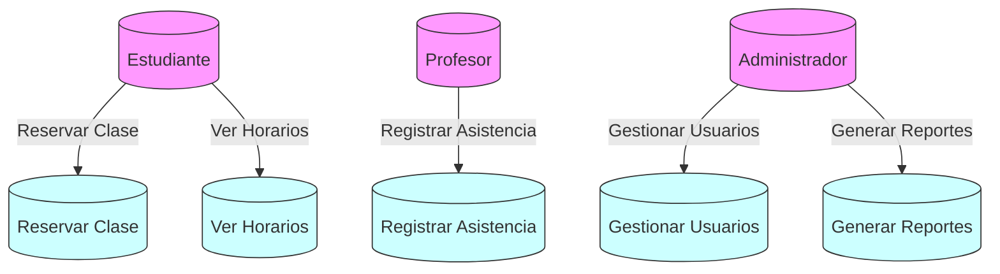

# Diagrama de Casos de Uso – Sistema de Danza

```mermaid
flowchart TD
    Estudiante[(Estudiante)]
    Profesor[(Profesor)]
    Administrador[(Administrador)]

    Estudiante -->|Reservar Clase| UC1[(Reservar Clase)]
    Estudiante -->|Ver Horarios| UC2[(Ver Horarios)]
    Profesor -->|Registrar Asistencia| UC3[(Registrar Asistencia)]
    Administrador -->|Gestionar Usuarios| UC4[(Gestionar Usuarios)]
    Administrador -->|Generar Reportes| UC5[(Generar Reportes)]

    classDef actor fill:#f9f,stroke:#333;
    classDef usecase fill:#cff,stroke:#333;

    class Estudiante,Profesor,Administrador actor
    class UC1,UC2,UC3,UC4,UC5 usecase
```
